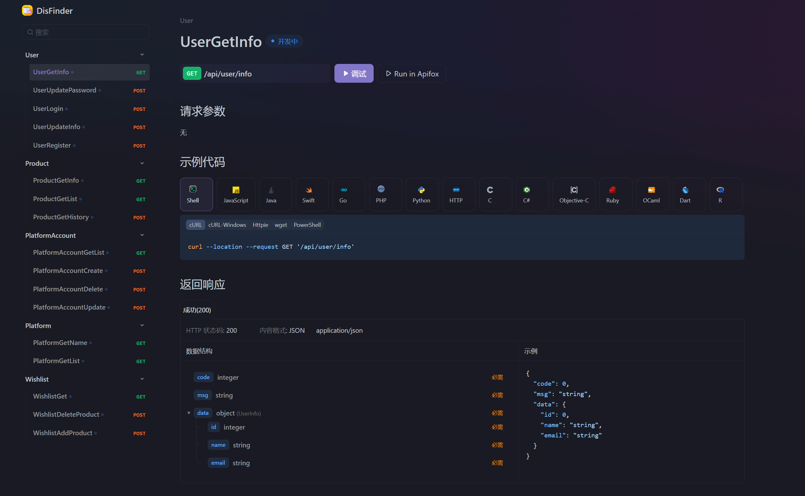
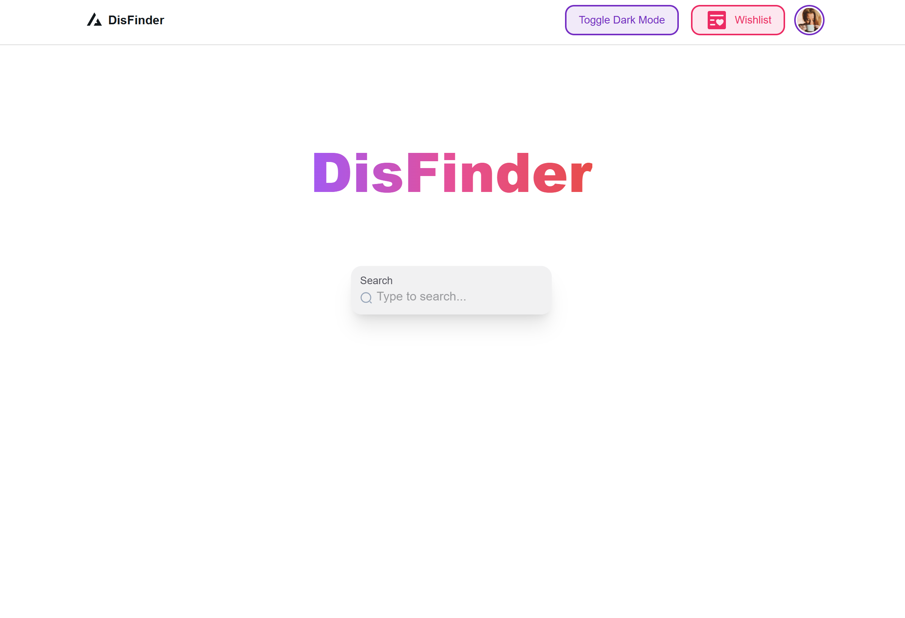
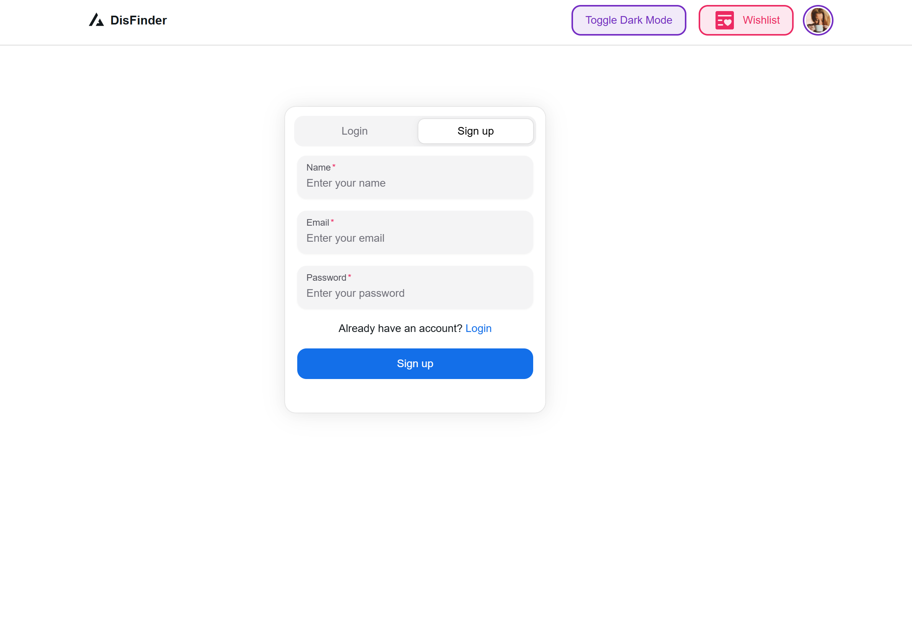
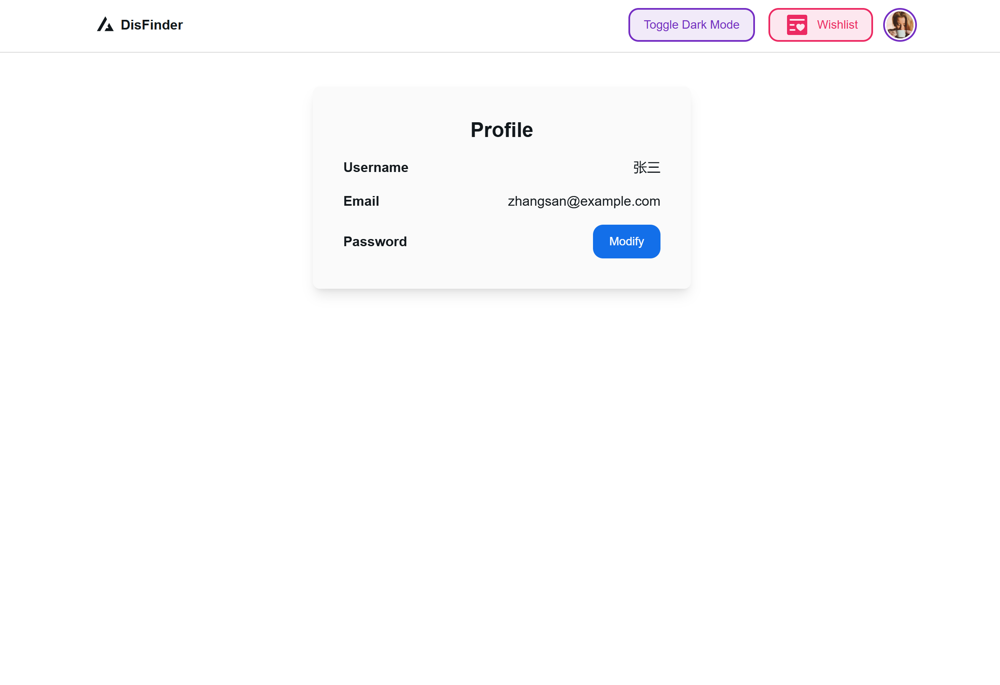
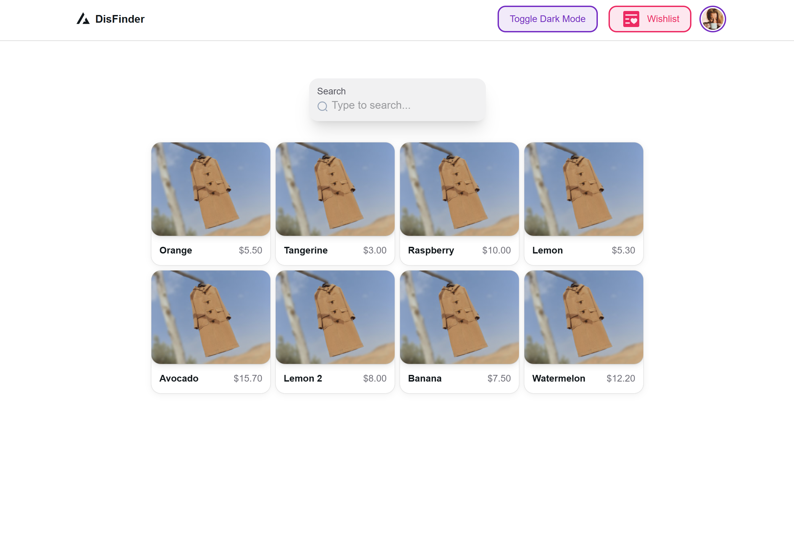
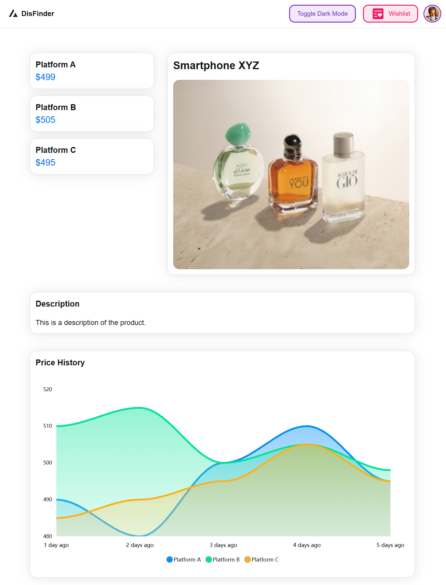
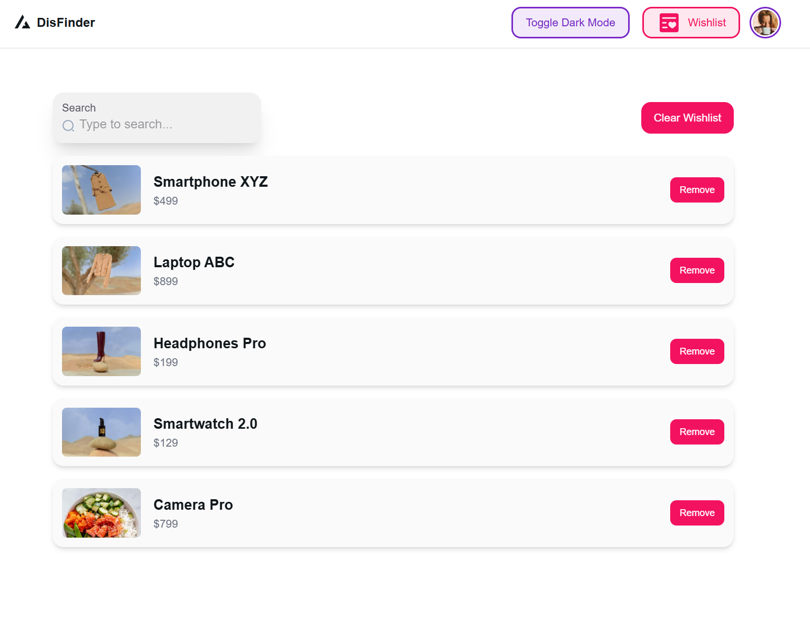
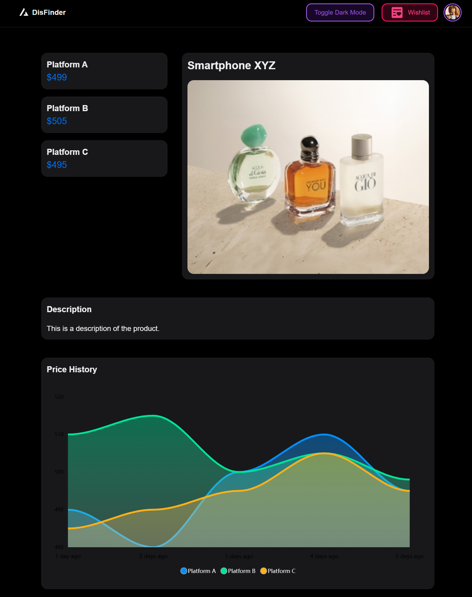

# 设计文档

## 项目概述

随着电子商务的快速发展，各种电商平台层出不穷，同一个商品在不同的平台上价格差异很大，用户往往需要在多个平台上比价才能找到最优惠的商品。本项目旨在为用户提供一个商品比价的工具，用户可以通过输入商品名称，获取该商品在不同电商平台上的价格信息，从而帮助用户快速找到最优惠的商品。

本项目名为 “寻惠” (DisFinder)，旨在帮助用户找到最优惠的商品。

## 项目总体需求

1. 用户输入商品名称，系统返回该商品在不同电商平台上的价格信息。
2. 能够显示历史价格信息，帮助用户了解商品价格走势。
3. 用户可以关注商品，系统会定时推送商品价格变动信息。
4. 支持用户注册、登录、修改密码等功能。
5. 支持移动网页端访问。

## 设计细节
### 模块设计

总体分为前端和后端两个部分，前端负责用户交互，后端负责数据处理。其中后端还包括数据采集模块和数据库模块。

#### 前端模块

前端主要包括以下几个页面。

1. 登录页面：用户登录、注册功能。
2. 商品搜索页面：用户输入商品名称，返回一系列满足要求的商品缩略信息，供用户选择对应的商品。
3. 商品详情页面：展示该商品的详细信息、各平台价格信息、历史价格走势等，并可以选择将商品添加到心愿单。
4. 用户中心页面：展示用户信息，提供修改密码、退出登录、管理电商平台账户等功能
5. 心愿单界面：展示用户关注的商品信息，提供取消关注、查看商品详情等功能。

#### 后端模块

后端主要包括以下几个模块。

1. 鉴权模块：负责校验用户登录状态，保护用户数据安全。
2. API 响应模块：负责处理前端请求，返回相应的数据。
3. 数据采集模块：负责从各电商平台上采集商品价格信息。
4. 数据操作模块：负责对数据库进行增删改查操作。
5. 数据库模块：负责存储用户信息、商品信息、价格信息等。
6. 定时任务模块：负责定时更新商品价格信息，推送商品价格变动信息。

#### 技术栈

- 前端：Next.js
- 后端：go
- 数据库：MySQL，使用 GORM 进行操作。
- 数据采集：Python

### 数据模型设计

#### 模型设计细节

主要涉及到以下数据模型：

##### User: 用户信息

- UID
- Name
- email
- Password

##### Product: 商品信息

- PID
- Name
- Description

##### Platform: 电商平台信息

- ID
- Name

##### PriceHistory: 商品价格历史信息

- PID
- PlatformID
- Date
- Price

##### WishList: 用户关注的商品信息

- UID
- PID

##### UserPlatform: 用户绑定的电商平台账户信息

- UID
- PlatformID
- Account
- Password

#### GORM 设计

由于我使用 GORM 进行数据库操作，因此只需要在 GO 中定义好数据模型，GORM 会自动创建对应的表。

```go
type User struct {
    ID        uint           `json:"id" gorm:"column:id;primary_key;AUTO_INCREMENT"`
    Name      string         `json:"name" gorm:"column:name;type:varchar(255);not null"`
    Password  string         `json:"password" gorm:"column:password;type:varchar(255);not null"`
    Email     string         `json:"email" gorm:"column:email;type:varchar(255);unique;not null"`
    Wishlist  []Product      `json:"wishlist" gorm:"manytomany:wishlists;"`
    Platforms []UserPlatform `json:"platform" gorm:"foreignKey:UserID"`
}
```

```go
type Product struct {
    ID          uint   `json:"id" gorm:"column:id;primary_key;AUTO_INCREMENT"`
    Name        string `json:"name" gorm:"column:name;type:varchar(255);not null"`
    Description string `json:"description" gorm:"column:description;type:varchar(1023);not null"`
    Picture     string `json:"picture" gorm:"column:picture;type:varchar(255);not null"`
    Users       []User `json:"users" gorm:"many2many:wishlists;"`
}

```

```go
type Platform struct {
    ID   uint   `json:"id" gorm:"column:id;primary_key;AUTO_INCREMENT"`
    Name string `json:"name" gorm:"column:name;type:varchar(255);not null"`
}
```

```go
type PriceHistory struct {
    ProductID  uint      `json:"product_id" gorm:"column:product_id;type:int;not null;primary_key"`
    PlatformID uint      `json:"platform_id" gorm:"column:platform_id;type:int;not null;primary_key"`
    Date       null.Time `json:"date" gorm:"column:date;type:date;not null"`
    Price      float64   `json:"price" gorm:"column:price;type:decimal(10,2);not null"`
}
```

```go
type UserPlatform struct {
    UserID     uint   `json:"user_id" gorm:"column:user_id;type:int;not null"`
    PlatformID uint   `json:"platform_id" gorm:"column:platform_id;type:int;not null"`
    Account    string `json:"account" gorm:"column:account;type:varchar(255);not null"`
    Password   string `json:"password" gorm:"column:password;type:varchar(255);not null"`
}
```

其中 Wishlist 的表由 GORM 自动创建，不需要额外定义。

### 接口设计

我使用 Apifox 工具进行接口设计，对数据模型和接口进行统一管理。

[Apifox 接口文档](https://apifox.com/apidoc/project-5427055/)



##### 用户信息接口

- 用户注册
- 用户登录
- 修改密码
- 用户信息查询
- 用户信息修改
- 登出

##### 电商平台账户接口

- 查询电商平台账户信息
- 绑定电商平台账户
- 解绑电商平台账户
- 修改电商平台账户信息

##### 电商平台接口

- 获取所有电商平台

##### 心愿单接口

- 查询心愿单
- 从心愿单中删除商品
- 添加商品到心愿单

##### 商品接口

- 查询商品信息 
- 查询商品历史价格信息
- 批量获取商品

### 前端设计

前端主要使用 Next.js 进行开发，使用 NextUI 进行 UI 设计。

主要包含以下几个页面：

- 主页面
- 用户登录页面
- 用户信息页面
- 商品搜索页面
- 商品详情页面
- 心愿单页面

以下是页面设计草案，不代表最终效果。

##### 主页面



##### 用户登录/注册界面



##### 用户信息界面



##### 商品搜索界面



##### 商品详情界面



##### 心愿单界面



##### 夜间模式



## 开发计划

- 冬 3 周：完成数据采集模块
- 冬 4 周 - 冬 5 周：完成后端，包括 API 响应模块、数据库模块、定时任务模块
- 冬 6 周 - 冬 7 周：完成前端，包括页面设计、前端逻辑，并与后端对接
- 冬 8 周：测试、部署、优化、完善文档