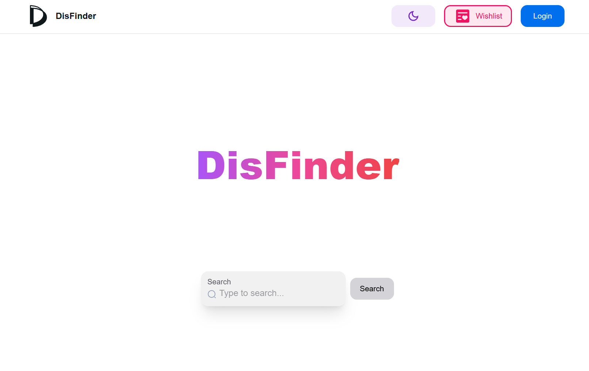

# B/S 体系软件设计实验报告

## 写在前面

由于在期中时只完成了前端的大致设计和 API 的设计，因此当初提交的设计文档只展示了大致的设计效果和主要技术路线，并没有详细的架构设计细节和具体代码实现，略显粗糙。同时在后续开发过程中，我也发现了一些设计上的问题，对 API 和前端设计进行了一些调整。因此在这次实验报告中，我将对之前的设计文档进行一些修改，同时对后端和爬虫的设计进行详细的描述。

## 总述

### 项目背景与介绍

随着电子商务的快速发展，各种电商平台层出不穷，同一个商品在不同的平台上价格差异很大，用户往往需要在多个平台上比价才能找到最优惠的商品。本项目旨在为用户提供一个商品比价的工具，用户可以通过输入商品名称，获取该商品在不同电商平台上的价格信息，从而帮助用户快速找到最优惠的商品。

本项目名为 “寻惠” (DisFinder)，旨在帮助用户找到最优惠的商品。由于国内平台对爬虫的限制较多，因此本项目主要针对国外电商平台，如亚马逊、eBay 等。

### 项目需求

本项目主要实现以下功能：

1. 用户输入商品名称，系统在不同电商平台上搜索该商品，并返回价格信息。
2. 用户可以将商品添加到心愿单，系统会定时推送商品价格变动信息。
3. 用户可以查看每一个商品的历史价格走势。
4. 用户进行基本的用户管理操作，如注册、登录、修改密码、修改个人信息等。
5. 实现响应式设计，支持移动端访问。

### 项目架构设计与技术栈

#### 需求实现思路

对于本项目提出的各项需求，我们可以将其大致分为前端、后端、数据库和爬虫四个部分，通过各部分的协作来实现整个项目。

1. 用户查询商品：用户在前端输入商品名称，前端将商品名称传递给后端，后端通过爬虫模块从各电商平台上获取商品价格信息，将数据保存到数据库中，然后将数据返回给前端。
2. 用户关注商品：用户在前端将商品添加到心愿单，后端将商品信息存储到数据库中，定时任务模块会定时检查商品价格变动情况，如果价格发生变动，会向用户发送邮件推送消息，同时将价格变动信息存储到数据库中。
3. 用户管理：用户在前端界面进行用户管理操作，然后前端将请求发送给后端，后端对数据库进行相应的操作。
4. 响应式设计：前端需要适配不同的设备，因此需要实现响应式设计。

#### 架构设计


项目的总体架构如图所示，主要分为前端、后端、数据库和爬虫四个部分。

- 前端：负责用户交互，用户输入商品名称、查看商品价格信息、添加商品到心愿单、查看历史价格走势等操作。它通过 API 与后端进行通信。
- 后端：负责处理前端的请求，调用爬虫模块获取商品价格信息，将数据存储到数据库中，同时处理用户管理操作。它通过 API 与前端进行通信，通过 ORM 与数据库进行交互，通过 API 与爬虫模块进行通信。
- 数据库：存储用户信息、商品信息、价格信息等数据。
- 爬虫：负责接受后端的请求，从各电商平台上获取商品价格信息，将数据返回给后端。

通过这样的架构设计，我们实现了前后端分离的 B/S 体系结构，同时将爬虫模块独立出来，方便后续的扩展和维护。

#### 技术栈

##### 前端

- 基于 Node.js 进行开发，Node.js 广泛应用于前端开发。
- 使用 Next.js 框架进行开发，Next.js 是一个 React 框架，提供了响应式渲染、静态导出等功能。
- 使用 NextUI 组件库进行开发，NextUI 是一个基于 React 的组件库，提供了丰富的组件，能够快速搭建前端界面，同时保证了界面的一致性。

##### 后端

- 基于 Go 进行开发，Go 广泛应用于后端开发中，具有高效、简洁、易用等特点，同时有丰富的第三方库能够支持网络编程、数据库操作等功能。
- 使用 Gin 框架进行开发，Gin 是一个轻量级的 Web 框架，提供了路由、中间件、参数绑定等功能，能够解析后端请求并通过中间件等功能进行鉴权处理。
- 使用 GORM 进行数据库操作，GORM 是一个 Go 语言的 ORM 库，提供了对数据库的增删改查等操作，支持多种数据库，如 MySQL、PostgreSQL、SQLite 等。
- 使用 Viper 进行配置管理，Viper 是一个 Go 语言的配置管理库，支持多种配置格式，如 JSON、YAML、TOML 等。

##### 数据库

- 使用 MySQL 作为数据库，MySQL 是一个开源的关系型数据库，具有高性能、高可靠性等特点，广泛应用于各种应用场景。它易于部署，同时受 GORM 支持，能够方便地进行数据库操作。

##### 爬虫

- 使用 Python 进行开发，具有丰富的第三方库支持，能够方便地进行网络爬虫开发。
- 使用 BeautifulSoup 进行 HTML 解析，从而获取商品价格信息。
- 使用 Flask 框架进行开发，Flask 是一个轻量级的 Web 框架，用于向后端提供爬虫服务。

## API 设计

在模块化的架构设计中，如何保证各模块间的统一通信是一个重要的问题。为此，我们设计了一套统一的 API 接口，用于前后端和爬虫模块之间的通信。

我们使用 Apifox 工具进行 API 设计，详细的 API 设计文档可以查看 [Apifox 接口文档](https://apifox.com/apidoc/project-5427055/)

##### 用户信息接口

这一系列接口主要用于用户管理，包括用户注册、用户登录、修改密码、用户信息查询、用户信息修改、登出等操作。

- `UserGetInfo`: 用户信息查询，通过用户 ID 查询用户信息。可以在用户信息页面中使用。此处直接通过鉴权中间件获取用户信息，不需要额外的参数。
- `UserUpdateInfo`: 用户信息修改，通过用户 ID 修改用户信息。可以在用户信息页面中使用。需要传递用户 ID 和修改后的用户信息。
- `UserRegister`: 用户注册，需要传递用户名、密码、邮箱信息。
- `UserLogin`: 用户登录，需要传递用户名和密码信息。
- `UserLogout`: 用户登出，不需要传递参数。
- `UserUpdatePassword`: 修改密码，需要传递用户 ID 、原密码和新密码，后端会对原密码进行验证。

##### 电商平台接口

这一系列接口主要用于电商平台管理，包括获取所有电商平台信息、获取单个电商平台信息等操作。

- `PlatformGetName`: 获取指定 ID 的电商平台名称，需要传递电商平台 ID。
- `PlatformGetList`: 获取所有电商平台信息，不需要传递参数。

##### 心愿单接口

这一系列接口主要用于用户心愿单管理，包括查询心愿单、添加商品到心愿单、从心愿单中删除商品等操作。由于心愿单是用户私有的，因此需要鉴权。

- `WishlistGet`: 查询心愿单，此处进行分页，需要传递页码和每页数量。
- `WishlistAdd`: 添加商品到心愿单，需要传递商品 ID。
- `WishlistDelete`: 从心愿单中删除商品，需要传递商品 ID。
- `WishlistClear`: 清空心愿单，不需要传递参数。

##### 商品接口

这一系列接口主要用于商品管理，包括查询商品信息、查询商品历史价格信息、批量获取商品等操作。

- `ProductSearch`: 向后端发起商品搜索请求，需要传递关键词。这个请求会让后端调用爬虫模块进行搜索，没有直接返回结果。
- `ProductGetList`: 获取指定关键词的商品列表，需要传递关键词、页码和每页数量。
- `ProductGetInfo`: 获取指定商品的详细信息，需要传递商品 ID。
- `ProductGetPriceHistory`: 获取指定商品的历史价格信息，需要传递商品 ID 和限定的时间范围。

从这里可以看到，商品的搜索分为两步，一是调用 `ProductSearch` 接口进行搜索，二是调用 `ProductGetList` 接口获取搜索结果。这样的设计可以让搜索逻辑更加清晰，同时也方便实现搜索结果的分页。

##### 爬虫接口

这一系列接口主要用于后端向爬虫模块发起请求，获取商品价格信息。

- `ScraperSearch`: 向爬虫模块发起商品搜索请求，需要传递关键词。
- `ScraperPoll`: 获取指定商品的价格信息，需要传递商品 ID。

通过统一的 API 设计，我们实现了前后端和爬虫模块之间的统一通信，保证了各模块之间的协作。

## 前端设计

### 结构设计

前端基于 Next.js 进行开发，整体的项目核心代码结构如下：

```
frontend/src
├── app
│   ├── auth
│   │   └── page.tsx
│   ├── favicon.ico
│   ├── fonts
│   │   ├── GeistMonoVF.woff
│   │   └── GeistVF.woff
│   ├── globals.css
│   ├── layout.tsx
│   ├── page.tsx
│   ├── product
│   │   └── [id]
│   │       └── page.tsx
│   ├── providers.tsx
│   ├── search
│   │   └── page.tsx
│   ├── user
│   │   └── page.tsx
│   └── wishlist
│       └── page.tsx
├── components
│   ├── DarkIcon.jsx
│   ├── LightIcon.jsx
│   ├── Loading.tsx
│   ├── Logo.jsx
│   ├── Navbar.tsx
│   ├── SearchBox.tsx
│   ├── SearchIcon.jsx
│   ├── ThemeSwitcher.tsx
│   └── WishlistIcon.jsx
└── models
    ├── error.tsx
    ├── models.tsx
    ├── request.tsx
    └── response.tsx
```

- `app`: 主要包含了各个页面的代码，如用户管理、商品搜索、商品详情、心愿单等页面。
- `components`: 主要包含了一些通用的组件，如 Navbar、SearchBox、ThemeSwitcher 等。
- `models`: 主要包含了一些数据模型，如请求、响应、错误等，保证 API 的统一性。

### 页面设计

前端主要包含以下几个核心页面和组件：

1. Navbar：导航栏，包含了 Logo、视觉模式切换、心愿单入口、用户管理入口。
2. SearchBox：搜索框，用户输入商品名称，点击搜索按钮后，会跳转到商品搜索页面。
3. ProductSearch：商品搜索页面，展示搜索结果，用户可以选择商品查看详情。
4. ProductDetail：商品详情页面，展示商品的详细信息、价格信息、历史价格走势等。
5. UserCenter：用户中心页面，展示用户信息，提供修改密码、退出登录、管理电商平台账户等功能。
6. Wishlist：心愿单页面，展示用户关注的商品信息，提供取消关注、查看商品详情等功能。
7. Auth：用户登录、注册页面，提供用户登录、注册功能。

下面逐一介绍这些页面的设计。

#### Navbar

##### 设计思路



Navbar 是整个网站的核心导航栏，包含了 Logo、视觉模式切换、心愿单入口、用户管理入口等。

Logo 是网站的标志，点击 Logo 可以回到首页。此处导航使用了 Next.js 的 Router，通过 `useRouter` 和 `push` 方法实现页面跳转。同时这里我自主设计了一个 Logo，通过 SVG 图片实现。

视觉模式切换是一个按钮，用户可以通过点击按钮切换视觉模式，包括 Light 和 Dark 两种模式。这里使用了 NextUI 提供的主题切换功能，通过 `useTheme` 和 `setTheme` 方法实现主题切换。

心愿单入口是一个按钮，用户可以通过点击按钮进入心愿单页面。这里使用了 Next.js 的 Router 实现页面跳转。

用户管理入口使用 NextUI 中的 `Dropdown` 组件实现，用户可以通过点击头像打开下拉菜单，可以查看用户信息、进入用户中心和退出登录。

##### 核心组件逻辑

在 Navbar 中，最核心的页面逻辑是对用户登录状态的判断，如果用户已登录，则显示用户头像和下拉菜单，否则显示登录和注册按钮。

为此，在 Navbar 组件中，我们需要通过向后端发送请求，获取用户信息，判断用户是否已登录。这里我们使用了 Next.js 提供的 `useEffect` 钩子函数，实现了在组件加载时向后端发送请求，获取用户信息的逻辑。

```tsx
useEffect(() => {
    const fetchUser = async () => {
        const response = await fetch(`${apiUrl}/api/user/info`, {
            method: 'GET',
            credentials: 'include',
        });

        const resp: Response = await response.json();
        console.log(resp)
        if (resp.code == ErrorCode.NoErr) {
            const user_resp: UserGetInfoResp = resp.data as UserGetInfoResp;
            const user: User = {
                id: user_resp.id,
                name: user_resp.name,
                email: user_resp.email,
            }
            setUser(user);
            setIsLogin(true);
        } else if (resp.code == ErrorCode.ErrNotLogin) {
            setIsLogin(false);
        } else {
            console.error(resp.msg);
        }

    };
    fetchUser();
}, []);
```

```tsx
{isLogin ? (
<Dropdown placement="bottom-end" className="text-foreground bg-background">
    ...
</Dropdown>
) : (
<Link href="/auth">
    <Button className="bg-primary-500 text-primary-50" color="primary" variant="solid" aria-label="Login">
        Login
    </Button>
</Link>
)}
```

其中的 `apiUrl` 是后端的 API 地址，通过 `.env` 文件配置。通过向 `/api/user/info` 发送 GET 请求，获取用户信息，根据返回的状态码判断用户是否已登录。然后根据用户登录状态，显示不同的内容。

在向后端请求的过程中，我们始终使用 models 中定义的请求和响应模型，保证了 API 的统一性。

同时此处需要注意的是，我们使用了 `credentials: 'include'` 选项，保证了在跨域请求时能够携带 Cookie，从而实现了用户登录状态的保持。

#### SearchBox

##### 设计思路

SearchBox 是一个搜索框，用户可以在搜索框中输入商品名称，然后点击搜索按钮进行搜索。搜索框的设计主要包括输入框和搜索按钮两部分。

输入框是一个文本输入框，用户可以在输入框中输入商品名称。这里使用了 NextUI 提供的 `Input` 组件，通过 `onChange` 属性实现输入框的绑定。

搜索按钮是一个按钮，用户可以通过点击按钮进行搜索。这里使用了 NextUI 提供的 `Button` 组件，通过 `onClick` 属性实现按钮的点击事件。同时为了指示用户在搜索时正在加载，我们使用了 NextUI 提供的 `Spinner` 组件，实现了搜索时的加载动画。

##### 核心组件逻辑

SearchBox 组件的核心逻辑是搜索功能的实现。用户在输入框中输入商品名称，然后点击搜索按钮，SearchBox 组件会将商品名称传递给后端，后端调用爬虫模块进行搜索，当搜索完成后通知前端，前端跳转到商品搜索页面。

```tsx
    const fetchSearch = async () => {
        const response = await fetch(`${apiUrl}/api/product/search?keyword=${query}`, {
            method: 'POST',
            credentials: 'include',
        });
        if (!response.ok) {
            console.error('Failed to search');
            setIsLoading(false);
            return;
        }

        const resp: Response = await response.json();
        console.log(resp)
        if (resp.code == ErrorCode.NoErr) {
            router.replace(`/search?keyword=${query}`);
        } else {
            console.error(resp.msg);
        }
        setIsLoading(false);
    };
```

这里我们跳转到商品搜索界面时，对商品搜索界面的路径采用 query 参数的形式，这样可以保证用户在搜索后刷新页面时，能够保留搜索结果。

#### ProductSearch

##### 设计思路


ProductSearch 页面是商品搜索结果展示页面，用户在搜索框中输入商品名称后，会跳转到该页面，展示搜索结果。搜索结果主要包括商品名称、商品价格、商品图片等信息。

搜索结果是一个列表，每个列表项包括商品名称、商品价格、商品图片等信息。这里使用了 NextUI 提供的 `Card` 组件，实现了列表项的展示。能够正确展示商品名称、价格、图片等信息。同时我们考虑到了商品名称过长的情况，实现了商品名称的截断显示。

每一个列表项都是一个链接，用户可以点击列表项进入商品详情页面。

同时在页面底部，我们提供了分页功能，用户可以通过点击页码进行翻页。这里使用了 NextUI 提供的 `Pagination` 组件，实现了分页功能。

##### 核心页面逻辑

ProductSearch 页面的核心逻辑是获取搜索结果，展示搜索结果，以及分页功能的实现。

在向后端发送请求前，我们需要通过 Next.js 中的 `useSearchParams` 获取 URL 中的 query 参数，从而获取用户输入的商品名称。然后向后端发送请求，获取搜索结果。(发送请求的逻辑与 SearchBox 中的逻辑类似，这里不再赘述)

```tsx
const params = useSearchParams();
const keyword = params.get('keyword');
```

然后是分页功能的实现。我们需要通过向后端发送请求，获取指定页码的搜索结果。这里我们使用了 NextUI 提供的 `Pagination` 组件，通过 `onChange` 属性实现页码的切换。

```tsx
const handlePageChange = (prev: number) => {
    setPageNum(prev);
};
// ...
<div className='mx-auto mt-8'>
    <Pagination showControls total={Math.ceil(total / page_size)} page={page_num} onChange={handlePageChange} size='lg' />
</div>
```
最后只需要在请求时传递页码参数，后端会返回指定页码的搜索结果。

#### ProductDetail


##### 设计思路

ProductDetail 页面是商品详情页面，用户在搜索结果中点击商品后，会跳转到该页面，展示商品的价格信息、历史价格走势等。

商品详情主要包括商品名称、商品价格、商品图片、商品平台等信息。

商品名称、商品图片是一个卡片，展示商品的名称和图片。这里使用了 NextUI 提供的 `Card` 组件，实现了商品名称和图片的展示。

商品价格和商品平台是另一个卡片，展示商品的价格和平台信息。同时这里还增加了两个按钮，一个是跳转到商品平台的按钮，用户可以通过点击按钮跳转到商品的购买页面；另一个是添加到心愿单的按钮，用户可以通过点击按钮将商品添加到心愿单。

商品历史价格走势是一个折线图，展示商品的历史价格走势。这里使用了 `rechart` 组件，实现了历史价格走势的展示。

##### 核心页面逻辑

ProductDetail 页面的路由参数是商品 ID，我们需要通过 `useParams` 获取商品 ID，才能向后端发送请求，获取商品的详细信息。

```tsx
const params = useParams();
const id = Number(params.id);
```

在这个页面中，包含多次向后端发送的请求：

1. 获取商品的详细信息，包括商品名称、商品价格、商品图片、商品平台等信息。
2. 获取商品的历史价格走势，包括商品的历史价格信息。
3. 根据商品平台的 ID 获取商品平台的名称。
4. 添加商品到心愿单。

此处使用了 `useEffect` 钩子函数，实现了在组件加载时向后端发送请求，获取商品的详细信息和历史价格走势。由于逻辑和 SearchBox 中的逻辑类似，这里不再赘述。

需要注意的是如果添加心愿单时用户仍未登录，便会跳转到登录页面。

同时在展示商品价格走势图时，我们需要将后端返回的历史价格信息转换为 `rechart` 组件需要的数据格式。需要注意的是，后端发来的 Date 是一个 ISO 格式的字符串，我们需要将其转换为更为简洁的日期格式。

```tsx
const formatDate = (time: string) => {
    // convert ISO time string to date
    const date = new Date(time);
    const year = date.getFullYear();
    const month = date.getMonth() + 1;
    const day = date.getDate();
    return `${year}-${month}-${day}`;
}
//...
const new_data: ChartData[] = [];
data.history.forEach((item: PriceHistory) => {
    new_data.push({ name: formatDate(item.date), price: item.price });
});
setData(new_data);
```

#### UserCenter

##### 设计思路


UserCenter 页面是用户中心页面，用户可以在该页面查看用户信息、修改密码、退出登录等操作。

用户信息是一个卡片，展示用户的用户名、邮箱等信息。用户可以通过点击修改密码按钮，进入修改密码页面。

修改密码页面是一个表单，用户可以在表单中输入原密码和新密码，然后点击提交按钮进行修改密码。

同时我们还提供了修改用户名的功能，用户可以通过点击修改用户名按钮，直接在页面上修改用户名。

##### 核心页面逻辑

UserCenter 页面的核心逻辑是获取用户信息，展示用户信息，以及修改密码的实现。其中展示用户信息的逻辑与 Navbar 中的逻辑类似，这里不再赘述。

修改密码的逻辑需要注意的是，我们需要检验用户两次输入的新密码是否一致，以及密码的长度是否符合要求。

```tsx
const handleSavePassword = async () => {
    if (newPassword !== confirmPassword) {
        alert('New passwords do not match. Please try again.');
        return;
    }

    if (newPassword.length < 6) {
        alert('Password must be at least 6 characters long.');
        return;
    }
    // send request to backend
}
```

同时在修改用户名时，我们也需要注意用户名是否为空。

```tsx
const handleSaveUsername = async () => {
    if (newUsername.trim() === '') {
        alert('Username cannot be empty.');
        return;
    }
    // send request to backend
}
```

#### Wishlist

##### 设计思路


Wishlist 页面是心愿单页面，用户可以在该页面查看用户关注的商品信息、取消关注商品等操作。

心愿单是一个列表，每个列表项包括商品名称、商品价格、商品图片等信息。用户可以通过点击列表项进入商品详情页面。同时每一个列表项还包括一个取消关注按钮，用户可以通过点击按钮取消关注商品。

同时我们还提供了清空心愿单的功能，用户可以通过点击清空按钮，清空心愿单。

##### 核心页面逻辑

Wishlist 页面的核心逻辑是获取心愿单信息，展示心愿单信息，以及取消关注商品的实现，分别对应了以下几个请求：

1. 获取心愿单信息，包括商品名称、商品价格、商品图片等信息。
2. 取消关注商品，用户点击取消关注按钮后，向后端发送请求，取消关注商品。
3. 清空心愿单，用户点击清空按钮后，向后端发送请求，清空心愿单。

这里的逻辑与 ProductSearch 中的逻辑类似，这里不再赘述。

需要注意的是，当请求返回后得知用户未登录时，我们需要跳转到登录页面，这里使用了 Next.js 提供的 `useRouter` 实现页面跳转，亦不再赘述。

#### Auth

##### 设计思路

Auth 页面是用户登录、注册页面，用户可以在该页面输入用户名、密码、邮箱等信息，进行登录、注册操作。

登录表单包括用户名、密码两个输入框，用户可以在输入框中输入用户名和密码，然后点击登录按钮进行登录。

注册表单包括用户名、密码、邮箱三个输入框，用户可以在输入框中输入用户名、密码和邮箱，然后点击注册按钮进行注册。

这里使用 NextUI 提供的 `Tab` 组件，实现了登录和注册两个 Tab 页的切换。

##### 核心页面逻辑

Auth 页面的核心逻辑是用户登录、注册的实现。

在登录时，我们需要向后端发送请求，验证用户名和密码是否正确。在注册时，我们需要向后端发送请求，注册新用户。这里的逻辑与 SearchBox 中的逻辑类似，这里不再赘述。

需要注意的是，在提交表单前，我们需要对用户输入的用户名、密码、邮箱等信息进行验证，保证其合法性。

```tsx
const handleLogin = async (e: React.FormEvent) => {
    e.preventDefault();

    setIsLoading(true);

    // check if email and password are empty
    if (email == "") {
        alert("Email is required");
        setIsLoading(false);
        return;
    }
    if (password == "") {
        alert("Password is required");
        setIsLoading(false);
        return;
    }
    // check email format
    const emailRegex = /^[a-zA-Z0-9._-]+@[a-zA-Z0-9.-]+\.[a-zA-Z]{2,6}$/;
    if (!emailRegex.test(email)) {
        alert("Invalid email format");
        setIsLoading(false);
        return;
    }
    // send request to backend
}
// ...
const handleRegister = async (e: React.FormEvent) => {
    e.preventDefault();

    setIsLoading(true);

    // check if username, email and password are empty
    if (username == "") {
        alert("Name is required");
        setIsLoading(false);
        return;
    }
    if (email == "") {
        alert("Email is required");
        setIsLoading(false);
        return;
    }
    if (password == "") {
        alert("Password is required");
        setIsLoading(false);
        return;
    }
    if (password.length < 6) {
        alert("Password must be at least 6 characters");
        setIsLoading(false);
        return;
    }
    // check email format
    const emailRegex = /^[a-zA-Z0-9._-]+@[a-zA-Z0-9.-]+\.[a-zA-Z]{2,6}$/;
    if (!emailRegex.test(email)) {
        alert("Invalid email format");
        setIsLoading(false);
        return;
    }
    // send request to backend
}
```

至此，我们完成了前端的设计，实现了用户登录、注册、商品搜索、商品详情、心愿单等功能，保证了用户的交互体验。

## 后端设计

### 架构设计


后端的架构设计参考了 [go-svc-tpl](https://github.com/thorn-jmh/go-svc-tpl) 的实现。如图所示，主要分为 API层、Controller层、Model 层、Service 层、DAO 层部分。

- API 层：负责处理前端的请求，将请求转发给 Controller 层。其中包括 API 的一系列数据模型定义（dto）和服务器的路由配置（router）。
- Controller 层：负责处理业务逻辑，调用 DAO 层和 Service 层进行数据操作。对每一个请求都有一个对应的 Controller 函数。
- Model 层：负责定义数据模型，包括用户信息、商品信息、价格信息等。这里使用了 GORM 进行数据库操作，因此定义了 GORM 的数据模型。
- DAO 层：负责与数据库进行交互，对数据库进行增删改查等操作。这里使用了 GORM 进行数据库操作，因此 DAO 层主要是对 GORM 的封装。
- Service 层：负责将一些复杂的业务逻辑封装成一个个的服务，供 Controller 层调用。其中主要包括商品搜索、商品价格获取和邮件推送服务。商品搜索服务和商品价格获取服务主要是调用爬虫模块，获取商品信息。邮件推送服务主要是向用户发送邮件推送消息。

下面我们逐一介绍这几个部分的设计。

### API 层

API 层主要包括 API 的一系列数据模型定义（dto）和服务器的路由配置（router）。

#### 数据模型定义

数据模型定义主要包括请求和响应的数据模型，保证了 API 的统一性。下面以 `ProductGetInfo` 接口为例，介绍数据模型的定义。

```go
type ProductGetInfoReq struct {
	ID uint `form:"id"`
}

type ProductGetInfoResp struct {
	ID         uint   `json:"id"`
	Name       string `json:"name"`
	Picture    string `json:"picture"`
	URL        string `json:"url"`
	PlatformID uint   `json:"platform_id"`
}
```

同时我们还定义了一些错误码，保证了 API 的统一性。

```go
const (
	NoErr           stacktrace.ErrorCode = iota // No error
	ErrEmailExist                               // 邮箱已被使用
	ErrPassword                                 // 密码错误
	ErrUserNotFound                             // 用户不存在

	ErrNotLogin  // 用户未登录
	ErrPrivilege // 权限不存在

	ErrPlatformNotFound // 平台不存在
	ErrProductNotFound  // 产品不存在
	ErrProductExist     // 产品已存在

	ErrSearchOutOfRange // 搜索范围超出限制

	ErrInvalidPage // 页码错误

	ErrEmptyWishlist // 心愿单为空

	ErrInvalidRequest // 参数错误

	BadRequest    stacktrace.ErrorCode = 400
	InternalError stacktrace.ErrorCode = 500
)
```

#### 路由配置

路由配置主要包括了服务器的路由配置，将请求转发给 Controller 层。下面以 `ProductGetInfo` 接口为例，介绍路由配置的定义。

首先我们需要将指定路径的请求转发给指定的 Controller 函数。这里我们使用了 Gin 框架的 `GET` 方法，将 `/product/info` 路径的 GET 请求转发给 `ProductGetInfo` 函数。

```go
func setupProductController(r *gin.RouterGroup) {
	cw := ProductCtlWrapper{
		ctl: controller.NewProductController(),
	}
	p := r.Group("/product")
	p.GET("/info", cw.GetInfo)
	p.POST("/search", cw.Search)
	p.POST("/history", cw.GetHistory)
	p.POST("/list", cw.GetList)
}
```

然后在绑定的 handler 函数中，我们需要解析请求参数，调用 Controller 函数，返回响应。

```go
func (w *ProductCtlWrapper) GetInfo(c *gin.Context) {
	var req dto.ProductGetInfoReq
	if err := dto.BindReq(c, &req); err != nil {
		dto.ResponseFail(c, err)
		return
	}
	resp, err := w.ctl.GetInfo(c, &req)
	if err != nil {
		dto.ResponseFail(c, err)
		return
	}
	dto.ResponseSuccess(c, resp)
}
```

这样我们就完成了请求的处理，其他接口的处理逻辑类似，这里不再赘述。

需要注意的是，对于需要鉴权的请求，我们需要在路由配置中添加鉴权中间件，保证了 API 的安全性。关于鉴权中间件的实现，我们将在 Controller 层中介绍。

```go
func setupUserController(r *gin.RouterGroup) {
	cw := UserCtlWrapper{
		ctl: controller.NewUserController(),
	}
	p := r.Group("/user")
	p.POST("/register", cw.Register)
	p.POST("/login", cw.Login)
	p.POST("/logout", controller.AuthMidWare(), cw.Logout)
	p.GET("/info", controller.AuthMidWare(), cw.GetInfo)
	p.POST("/info", controller.AuthMidWare(), cw.UpdateInfo)
	p.POST("/passwd", controller.AuthMidWare(), cw.UpdatePwd)
}
```

此处需要额外说明的是，由于前端域名和后端域名不一致，因此我们需要配置跨域访问（CORS）。在这里我们使用 `gin-contrib/cors` 配置跨域访问中间件，允许指定来源的请求。

```go
config := cors.Config{
    AllowOrigins:     []string{"http://localhost:3010", "http://localhost"},
    AllowCredentials: true,
    AllowMethods:     []string{"GET", "POST", "PUT", "PATCH", "DELETE", "HEAD", "OPTIONS"},
    AllowHeaders:     []string{"Origin", "Content-Length", "Content-Type"},
}
e.Use(cors.New(config))
```

### Model 层

Model 层主要包括了数据模型的定义，保证了数据的一致性。这里我们使用了 GORM 进行数据库操作，因此定义了 GORM 的数据模型。

##### User

```go
type User struct {
	ID       uint   `json:"id" gorm:"column:id;primary_key;AUTO_INCREMENT"`
	Name     string `json:"name" gorm:"column:name;type:varchar(255);not null"`
	Password string `json:"password" gorm:"column:password;type:varchar(255);not null"`
	Email    string `json:"email" gorm:"column:email;type:varchar(255);unique;not null"`
}
```

这里我们定义了用户的 ID、用户名、密码、邮箱等信息，指定 email 为唯一键，用户将通过邮箱进行登录。同时我们约束用户名、密码、邮箱等字段的长度和非空性。

##### Platform

```go
type Platform struct {
	ID   uint   `json:"id" gorm:"column:id;primary_key;AUTO_INCREMENT"`
	Name string `json:"name" gorm:"column:name;type:varchar(255);not null"`
}
```

这里我们定义了电商平台的 ID 和名称，用户可以通过平台 ID 获取平台名称。虽然在我们的应用中，平台名称是固定的，但是我们仍然将其定义为一个数据模型，保证了数据的一致性，并且方便了后续的扩展。

##### Product

```go
type Product struct {
	ID         uint     `json:"id" gorm:"column:id;primary_key;AUTO_INCREMENT"`
	Name       string   `json:"name" gorm:"column:name;type:varchar(255);not null;unique"`
	Picture    string   `json:"picture" gorm:"column:picture;type:text;not null"`
	URL        string   `json:"url" gorm:"column:url;type:text;not null"`
	PlatformID uint     `json:"platform_id" gorm:"column:platform_id;type:int;not null"`
	Platform   Platform `json:"platform" gorm:"foreignKey:PlatformID;references:ID"`
}
```

这里我们定义了商品的 ID、名称、图片、链接、平台 ID 等信息，用户可以通过商品 ID 获取商品的详细信息。同时我们约束商品名称、图片、链接等字段的长度和非空性。

需要注意的是，由于电商平台商品名称的特殊性，我们确定每一个商品名称只能对应一个平台，因此我们将商品名称定义为唯一键。

##### PriceHistory

```go
type PriceHistory struct {
	ProductID uint      `json:"product_id" gorm:"column:product_id;type:int;not null;primary_key"`
	Date      null.Time `json:"date" gorm:"column:date;type:date;not null;primary_key"`
	Price     float64   `json:"price" gorm:"column:price;type:decimal(10,2);not null"`
}
```

这里我们定义了商品的价格历史信息，包括商品 ID、日期、价格等信息。用户可以通过商品 ID 获取商品的历史价格信息。同时我们约束商品 ID、日期、价格等字段的非空性。

##### Wishlist

```go
type Wishlist struct {
	UserID    uint    `json:"user_id" gorm:"primaryKey"`
	ProductID uint    `json:"product_id" gorm:"primaryKey"`
	User      User    `gorm:"foreignKey:UserID"`
	Product   Product `gorm:"foreignKey:ProductID"`
}
```

这里我们定义了用户的心愿单信息，包括用户 ID、商品 ID 等信息。用户可以通过用户 ID获取用户的心愿单信息。同时我们约束用户 ID、商品 ID等字段的非空性。实际上，心愿单描述了用户和商品之间的多对多关系。

### DAO 层

DAO 层主要负责与数据库进行交互，对数据库进行增删改查等操作。这里我们使用了 GORM 进行数据库操作，因此 DAO 层的主要工作是初始化数据库连接，调用 GORM 的 API 进行数据库操作。

#### 初始化数据库连接

这里我们通过 viper 读取配置文件，获取数据库的连接信息，然后使用 GORM 连接数据库。同时我们使用了 GORM 的 `AutoMigrate` 方法，自动根据 Model 层的定义创建数据库表。这里还初始化了本项目中的电商平台信息。

```go

func InitDB() {
	var cfg DBCfg
	err := viper.Sub("Database").UnmarshalExact(&cfg)
	if err != nil {
		logrus.Fatal(err)
	}

	db, err = gorm.Open(mysql.Open(cfg.DSN), &gorm.Config{TranslateError: true, DisableForeignKeyConstraintWhenMigrating: true})
	if err != nil {
		logrus.Fatal(err)
	}

	if err := db.AutoMigrate(&model.Wishlist{}, &model.Product{}, &model.User{}, &model.Platform{}, &model.PriceHistory{}); err != nil {
		logrus.Fatal(err)
	}

	InitPlatform()

	if viper.GetString("App.RunLevel") == "debug" {
		db = db.Debug()
	}

}
```

#### 调用 GORM API

这里我们定义了一个 `DBMS` 结构体，包含了 GORM 的 DB 对象，然后定义了一个 `DB` 函数，返回一个 `DBMS` 对象。

```go
type DBMS struct {
	*gorm.DB
}

var (
	db *gorm.DB
)

var DB = func(ctx context.Context) *DBMS {
	return &DBMS{db.WithContext(ctx)}

}
```

这样我们就可以在 DAO 层中调用 GORM 的 API，对数据库进行增删改查等操作。下面以 `Create` 方法为例介绍调用方法。

```go
dao.DB(ctx).Create(&product)
```

### Controller 层

Controller 层是整个后端的核心，负责处理业务逻辑，调用 DAO 层和 Service 层进行数据操作。对每一个请求都有一个对应的 Controller 函数。

#### 鉴权中间件

我们使用 JWT 进行用户鉴权，保证了 API 的安全性。我们定义了一个 `AuthMidWare` 中间件，对需要鉴权的请求进行鉴权。

##### Token 生成

```go
func generateToken(userID uint) (string, error) {
	claims := AuthClaims{
		userID,
		jwt.RegisteredClaims{
			ExpiresAt: jwt.NewNumericDate(time.Now().Add(Duration)),
			IssuedAt:  jwt.NewNumericDate(time.Now()),
		},
	}
	token := jwt.NewWithClaims(jwt.SigningMethodHS256, claims)
	tokenString, err := token.SignedString(secretKey)
	if err != nil {
		return "", err
	}
	return tokenString, nil
}
```

我们定义了一个 `generateToken` 函数，根据用户 ID 生成一个 JWT Token。Token 的有效期为 7 天。这里我们需要配置一个 secretKey，保证 Token 的安全性。同样通过 viper 读取配置文件，获取 secretKey。

```go
func InitSecret() {
	var cfg secretCfg
	if err := viper.Sub("Auth").UnmarshalExact(&cfg); err != nil {
		panic(err)
	}
	secretKey = []byte(cfg.Secret)
}
```

##### 鉴权中间件

在鉴权中间件中，我们需要解析请求头中的 Token，然后验证 Token 的有效性。如果 Token 有效，我们将用户 ID 存入请求上下文中，供后续的请求使用。

```go
func parseToken(tokenString string) (*AuthClaims, error) {
	claims := new(AuthClaims)
	//parse token
	token, err := jwt.ParseWithClaims(tokenString, claims, func(token *jwt.Token) (interface{}, error) {
		return secretKey, nil
	})
	if err != nil {
		return nil, err
	}
	//check validity of token
	if claims, ok := token.Claims.(*AuthClaims); ok && token.Valid {
		return claims, nil
	}
	return nil, err
}

func AuthMidWare() gin.HandlerFunc {
	return func(c *gin.Context) {
		//get token
		tokenString, err := c.Cookie("token")
		if err != nil {
			dto.ResponseFail(c, stacktrace.NewErrorWithCode(dto.ErrNotLogin, "User not login."))
			c.Abort()
			return
		}
		//verify token
		claims, err := parseToken(tokenString)
		if err != nil {
			dto.ResponseFail(c, err)
			c.Abort()
			return
		}
		//set userID in context
		c.Set("userID", claims.UserID)
		c.Next()

	}
}
```

#### User

##### Login

在用户登录时，我们需要验证用户的邮箱和密码是否正确。首先我们根据用户的邮箱查询用户信息，然后验证用户的密码是否正确。如果密码正确，我们调用鉴权模块生成一个 Token，将 Token 存入 Cookie 中，保证用户的登录状态。

这里可以看到，我们通过 dao 层对数据库进行统一操作，并对响应的错误进行统一的处理，保证了后端逻辑的一致性。

```go
func (c *UserController) Login(ctx *gin.Context, req *dto.UserLoginReq) error {
	user := model.User{
		Email: req.Email,
	}
	// 1. check if user exists
	err := dao.DB(ctx).Where(&user).First(&user).Error
	if err != nil {
		if errors.Is(err, gorm.ErrRecordNotFound) {
			return stacktrace.PropagateWithCode(err, dto.ErrUserNotFound, "User not found.")
		}
		return err
	}
	// 2. check if password is correct
	if user.Password != HashWithSHA256(req.Password) {
		return stacktrace.NewErrorWithCode(dto.ErrPassword, "Wrong password.")
	}
	// 3. generate token
	tokenString, err := generateToken(user.ID)
	if err != nil {
		return err
	}
	// 4. set token in cookie
	setCookie(ctx, tokenString)
	return nil
}
```

##### Register

在用户注册时，我们需要验证用户的邮箱是否已被注册。如果邮箱未被注册，我们将用户的信息存入数据库，完成注册。这里我们将用户的密码进行了哈希处理，保证了用户密码的安全性。

```go
func (c *UserController) Register(ctx *gin.Context, req *dto.UserRegisterReq) error {
	tx := dao.DB(ctx)

	user := model.User{
		Email:    req.Email,
		Password: HashWithSHA256(req.Password),
		Name:     req.Name,
	}
	// check email format
	pattern := `\w+([-+.]\w+)*@\w+([-.]\w+)*\.\w+([-.]\w+)*` //匹配电子邮箱
	reg := regexp.MustCompile(pattern)
	if !reg.MatchString(user.Email) {
		return stacktrace.NewError("Email format is wrong.")
	}
	err := tx.Create(&user).Error
	if err != nil {
		if errors.Is(err, gorm.ErrDuplicatedKey) {
			return stacktrace.PropagateWithCode(err, dto.ErrEmailExist, "Email already exists.")
		}
		return err
	}

	return nil
}
```

##### Logout

在用户登出时，我们需要清除用户的 Token，保证用户的登出状态即可。

```go
func (c *UserController) Logout(ctx *gin.Context) error {
	ctx.SetCookie("token", "", -1, "/", "localhost", false, true)
	return nil
}
```

##### UpdateInfo, UpdatePwd, GetInfo

这几个接口的实现逻辑类似，都是根据请求对数据库进行增删改查等操作，这里不再赘述。

需要注意的是，这几个接口都需要鉴权，我们在路由配置中添加了鉴权中间件，保证了 API 的安全性。然后在 Controller 函数中，我们从请求上下文中获取用户 ID，保证了用户只能修改自己的信息。

```go
	userID := ctx.GetUint("userID")
```

#### Wishlist

Wishlist 有 `Add`、`Delete`、`List`、`Clear` 等接口，这里我们以 `List` 接口为例介绍实现逻辑。

`List` 接口的特点是有分页逻辑的处理，逻辑如下：

1. 首先我们需要获取用户的 ID，根据用户 ID 查询用户的心愿单信息。
2. 然后我们需要根据用户的心愿单信息查询商品的详细信息。
3. 接着我们要利用 Count 方法获取心愿单的总数，然后根据页码和每页数量计算需要返回的心愿单条目索引，并利用 Limit 和 Offset 方法获取心愿单的分页信息。
4. 最后我们将心愿单信息和商品信息组合返回。

下面展示分页核心逻辑实现的部分代码。
```go
// get products
tx := dao.DB(c).Model(&model.Product{}).Where("id IN (?)", pids)
err = tx.Count(&resp.Total).Error
if err != nil {
    return nil, stacktrace.PropagateWithCode(err, dto.InternalError, "Failed to get wishlist")
}
if resp.Total == 0 {
    return nil, stacktrace.NewErrorWithCode(dto.ErrEmptyWishlist, "Wishlist is empty")
}
if resp.Total < int64(req.PageNum*req.PageSize) {
    return nil, stacktrace.NewErrorWithCode(dto.ErrInvalidPage, "Invalid page number")
}
err = tx.Offset(req.PageNum * req.PageSize).Limit(req.PageSize).Find(&products).Error
if err != nil {
    return nil, stacktrace.PropagateWithCode(err, dto.InternalError, "Failed to get wishlist")
}
```

其余的接口实现均是对数据库的基本增删改查操作，这里不再赘述。

#### Platform

Platform 有 `List` 和 `Get` 接口，均是对数据库的基本增删改查操作，这里不再赘述。

#### Product

Product 系列接口是整个后端的核心，包括了商品搜索、商品价格获取、商品历史价格走势等功能。

##### GetInfo

这个接口获取商品详细信息，只需要根据商品 ID 查询商品信息即可，此处不再赘述。

##### Search

这个接口是商品搜索的核心，需要调用爬虫模块获取商品信息，然后添加到数据库中。首先调用 Service 层的 `Search` 函数，获取商品信息，然后将商品信息添加到数据库中。需要注意的是我们既需要添加新商品，也需要更新商品的价格信息。

```go
// search from search engine
searchResult, err := SearchEngine(req.Keyword)
if err != nil {
    return err
}
// add to database
for _, item := range searchResult {
    newProduct := model.Product{
        Name:       item.Title,
        Picture:    item.Image,
        URL:        item.URL,
        PlatformID: item.PlatformID,
    }
    err := dao.DB(c).Create(&newProduct).Error
    if err != nil {
        newProduct.URL = ""
        newProduct.Picture = ""
        err = dao.DB(c).Where(&newProduct).First(&newProduct).Error
        if err != nil {
            continue
        }
    }
    newPriceHistory := model.PriceHistory{
        ProductID: newProduct.ID,
        Date:      null.NewTime(time.Now(), true),
        Price:     item.Price,
    }
    err = dao.DB(c).Create(&newPriceHistory).Error
    if err != nil {
        continue
    }
}
```

##### GetList

这个接口是获取商品列表的核心，需要根据页码和每页数量获取商品列表。首先我们需要获取商品的总数，然后根据页码和每页数量计算需要返回的商品索引，并利用 Limit 和 Offset 方法获取商品的分页信息。此处的逻辑与 Wishlist 中的分页逻辑类似，这里不再赘述。

这里需要注意的是，需要对商品名称进行模糊查询，保证了搜索的准确性。

```go
for _, keyword := range keywords {
    tx = tx.Where("name LIKE ?", "%"+keyword+"%")
}
```

同时我们还需要从 PriceHistory 表中获取商品的最新价格信息，保证了商品价格的准确性。

```go
var history model.PriceHistory
err := dao.DB(c).Model(&model.PriceHistory{}).Where("product_id = ?", item.ID).Order("date desc").First(&history).Error
if err != nil {
    return nil, stacktrace.PropagateWithCode(err, dto.InternalError, "Database error")
}
```

##### GetHistory

这个接口是获取商品历史价格走势的核心，需要根据商品 ID 和指定日期范围获取商品的历史价格信息。首先我们需要获取商品的历史价格信息，然后根据日期范围筛选商品的历史价格信息。需要注意的是我们需要检查日期范围是否合法，并利用范围查找方法获取商品的历史价格信息。

```go
// query validation
if req.StartDate.Time.After(req.EndDate.Time) {
    return nil, stacktrace.NewErrorWithCode(dto.ErrInvalidRequest, "Invalid date range")
}

err := dao.DB(c).Where("product_id = ? AND date >= ? AND date <= ?", req.ProductId, req.StartDate, req.EndDate).Find(&history).Error
if err != nil {
    return nil, stacktrace.PropagateWithCode(err, dto.ErrProductNotFound, "Product not found")
}
```

### Service 层

在 Service 层中，我们将一些复杂的业务逻辑封装成一个个的服务，供 Controller 层调用。这里我们主要包括爬虫服务，价格轮询和邮件推送服务。

#### Scraper

首先我们需要从配置中读取爬虫的配置信息，初始化爬虫服务。

```go
type ScraperConfig struct {
	Host string
}

func InitScraper() {
	var cfg ScraperConfig
	err := viper.Sub("Scraper").Unmarshal(&cfg)
	if err != nil {
		logrus.Fatal(err)
	}

	scraper = newScraper(cfg.Host)
}
```

在爬虫服务中，我们提供了两个接口，分别是 `Search` 和 `Poll`。`Search` 接口用于搜索商品信息，`Poll` 接口用于获取商品价格信息。

两者的逻辑类似，都是向指定的 URL 发送请求，并解析对应的相应信息。下面以 `Search` 接口为例展示实现逻辑。

```go
func (s *Scraper) Search(keyword string) (*dto.SearchResp, error) {
	var rawResp dto.SearchResp
	// send http request to search engine
	url := s.GetHost() + "/scraper/search?keyword=" + keyword
	httpResp, err := http.Get(url)
	if err != nil {
		return nil, stacktrace.PropagateWithCode(err, dto.InternalError, "Search engine error")
	}
	defer httpResp.Body.Close()
	err = json.NewDecoder(httpResp.Body).Decode(&rawResp)
	if err != nil {
		return nil, stacktrace.PropagateWithCode(err, dto.InternalError, "Search engine error")
	}
	return &rawResp, nil
}
```

#### Polling

Polling 服务用于定时获取商品价格信息，我们使用了 `time.Ticker` 定时器，每隔一段时间获取一次商品价格信息。

```go
func InitPolling(interval time.Duration) {
	ticker := time.NewTicker(interval)

	go func() {
		defer ticker.Stop()
		for {
			select {
			case <-ticker.C:
				Polling()
			}
		}
	}()
}
```

而我们的 Polling 时间间隔也是从配置文件中读取的。

```go
func InitService() {
	var cfg Cfg
	err := viper.Sub("Service").UnmarshalExact(&cfg)
	if err != nil {
		logrus.Fatal(err)
	}
	InitPolling(time.Duration(cfg.PollingInterval) * time.Hour)
}
```

这里的核心逻辑是 `Polling` 函数的实现，它的实现逻辑如下：

1. 从 Wishlist 表中获取所有的商品 ID。
2. 遍历商品 ID，调用爬虫服务的 `Poll` 接口，获取商品价格信息。
3. 将商品价格信息添加到 PriceHistory 表中。
4. 维护一个用户 ID 到商品 ID 列表的映射，如果该商品价格低于用户的心愿价格，添加到邮件推送列表中。
5. 调用邮件推送服务，向用户发送邮件推送消息。

此处省略具体实现代码，完整细节请参考源码。

#### Email

Email 服务用于向用户发送邮件推送消息，我们使用了 `net/smtp` 库进行邮件发送。

首先我们需要初始化邮件服务，读取邮件的配置信息。

```go
type EmailCfg struct {
	Host     string
	Port     int
	User     string
	Password string
}

var cfg EmailCfg
err := viper.Sub("Email").UnmarshalExact(&cfg)
if err != nil {
    logrus.Fatal(err)
}
```

然后我们需要根据传递的推送数据，构造邮件内容。

```go
func createEmailContent(notices []DiscountNoticeItem) string {
	// create Subject
	subject := "Subject: 商品降价通知\n"

	// create Body
	var bodyBuilder strings.Builder
	bodyBuilder.WriteString("亲爱的用户，\n\n")
	bodyBuilder.WriteString("以下是您关注的商品降价信息：\n\n")
	bodyBuilder.WriteString("商品名称\t\t原价\t\t降价后价\t降幅\n")

	// generate email content
	for _, p := range notices {
		discount := p.OldPrice - p.NewPrice
		discountPercentage := (discount / p.OldPrice) * 100
		bodyBuilder.WriteString(fmt.Sprintf("%s\t%.2f\t%.2f\t%.2f%%\n", p.Name, p.OldPrice, p.NewPrice, discountPercentage))
	}

	bodyBuilder.WriteString("\n祝您购物愉快！\n")

	// return email content
	return subject + "\n" + bodyBuilder.String()
}
```

最后我们需要调用 `net/smtp` 库发送邮件。

```go
from := cfg.User
password := cfg.Password
smtpHost := cfg.Host
smtpPort := fmt.Sprintf("%d", cfg.Port)
// auth
auth := smtp.PlainAuth("", from, password, smtpHost)

// send email
err = smtp.SendMail(smtpHost+":"+smtpPort, auth, from, []string{to}, []byte(emailContent))
if err != nil {
    return err
}
```


至此，我们完成了后端的设计，实现了用户的登录、注册、商品搜索、商品详情、心愿单等功能，保证了后端的逻辑一致性。

## 爬虫设计

爬虫的架构较为简单，主要分为服务层和爬虫层两部分。由于爬虫的实现逻辑较为简单，主要的开发时间都花费在 HTML 内容解析这类 dirty work 上，因此这里不再过多赘述详细的实现逻辑，详细细节请参考源码。

在最初设计时，原本计划对国内电商平台进行爬取，但是由于国内电商平台的反爬机制较为严格，因此我们最终选择了国外电商平台 Amazon 和 Ebay 进行爬取。

##### 爬虫层

爬虫层主要负责爬取商品信息，包括商品名称、商品价格、商品图片、商品链接等信息。这里我们使用了 Python 的 requests 库和 BeautifulSoup 库进行爬取。通过 requests 库发送 HTTP 请求，获取网页的 HTML 内容，然后通过 BeautifulSoup 库解析 HTML 内容，获取商品信息。

这里我设计了两个类，分别是 AmazonParser 和 EbayParser，分别用于爬取 Amazon 和 Ebay 的商品信息。这两个类都提供了 `Search` 和 `Poll` 接口，分别用于搜索商品信息和获取商品价格信息。

每一个接口内部的逻辑是类似的，都是向指定的 URL 发送请求，然后解析对应的相应信息。这里以 `Search` 接口为例展示实现逻辑。

```python
    def search(self, keyword) -> list:
        url = self.search_url + keyword
        print(keyword)
        print(url)
        html = utils.fetch_page(url)
        result_list = self.get_result_list(html)
        res_list = [self.parse_result(result) for result in result_list]
        res_list = [res for res in res_list if res]
        return res_list
```

首先我们需要构造搜索的 URL，然后发送 HTTP 请求，获取网页的 HTML 内容。接着我们需要解析 HTML 内容，获取商品列表中的每一个商品元素，然后解析商品元素，获取商品信息。

对于商品信息的解析，我们需要根据 HTML 内容的结构，使用 BeautifulSoup 库解析 HTML 内容，找到对应的元素进行解析，最终获取商品信息。具体的解析逻辑这里不再赘述，详细细节请参考源码。

##### 服务层

服务层主要负责调用爬虫层，获取商品信息。这里我们使用了 Flask 框架，提供了两个接口，分别是搜索接口和轮询接口。搜索接口用于搜索商品信息，轮询接口用于获取商品价格信息。

首先我模仿了后端的设计，同样定义了统一的响应格式，保证了 API 的一致性。

```python
class SearchResponse:
    def __init__(self, code, msg, products):
        self.code = code
        self.msg = msg
        self.data = products

    def to_dict(self):
        return {
            'code': self.code,
            'msg': self.msg,
            'data': self.data
        }

class PollResponse:
    def __init__(self, code, msg, price):
        self.code = code
        self.msg = msg
        self.data = price if price else None
        
    def to_dict(self):
        return {
            'code': self.code,
            'msg': self.msg,
            'data': self.data
        }
```

然后在 Flask 中绑定两个路由，并在每个 handler 中分别调用爬虫层的接口，获取商品信息。不同的是，Search 需要分别调用 AmazonParser 和 EbayParser 的 Search 接口，获取商品信息，而 Poll 只需要根据 URL 调用对应的 Parser 的 Poll 接口即可。

```python
def search_handler(keyword: str) -> SearchResponse:
    results = []
    keyword = keyword.replace(' ', '+')
    # search for amazon
    amazon_parser = AmazonParser()
    amazon_results = amazon_parser.search(keyword)
    results.extend(amazon_results)
    # search for ebay
    ebay_parser = EBayParser()
    ebay_results = ebay_parser.search(keyword)
    results.extend(ebay_results)
    return SearchResponse(200, 'Success', results)
```

```python
def poll_handler(url):
    if 'amazon' in url:
        parser = AmazonParser()
        price = parser.poll(url)
        if price < 0:
            return PollResponse(400, 'Failed', -1)
        return PollResponse(200, 'Success', price)
    elif 'ebay' in url:
        parser = EBayParser()
        price = parser.poll(url)
        if price < 0:
            return PollResponse(400, 'Failed', None)
        return PollResponse(200, 'Success', price)
    else:
        return PollResponse(400, 'Bad request', None)
```

## 部署

我使用 Docker Compose 进行部署，将整个项目分为四个容器，分别是数据库容器、后端容器、前端容器和爬虫容器。

### 数据库容器

数据库容器基于 MySQL 构建，不需要额外的 Dockerfile，只需要在 docker-compose.yml 中配置即可。通过环境变量设置 MySQL 的 root 密码、数据库名称、普通用户名称和密码，然后将 MySQL 的 3306 端口映射到宿主机的 3306 端口，最后将 MySQL 的数据目录映射到宿主机的目录中。

```yaml
  mysql:
    image: mysql:8.0
    environment:
      MYSQL_ROOT_PASSWORD: root_password # 设置 root 密码
      MYSQL_DATABASE: disfinder # 创建名为 disfinder 的数据库
      MYSQL_USER: disfinder # 创建一个名为 disfinder 的普通用户
      MYSQL_PASSWORD: disfinder_passwd # 设置该用户的密码
    ports:
      - "3306:3306"
    volumes:
      - mysql-data:/var/lib/mysql
```

### 后端容器

后端容器基于 Golang 构建，我们将源码复制到容器中，然后编译生成可执行文件。

```dockerfile
# 使用 Go 官方镜像
FROM golang:1.23-alpine

WORKDIR /app

# 将 Go 源码复制到容器
COPY . .

# 安装依赖并编译 Go 后端
RUN go mod tidy && go build -o main .

# 暴露 Go 后端服务端口
EXPOSE 8080

CMD ["./main"]
```

在 docker-compose.yml 中配置后端容器，将后端服务的 8080 端口映射到宿主机的 8081 端口。需要注意的是，前端访问的是后端容器映射到宿主机的 8081 端口。

```yaml
  backend:
    build:
      context: ./backend # 指定 Go 后端目录
    depends_on:
      - mysql
    ports:
      - "8081:8080"
```

### 前端容器

前端容器基于 Node 构建，我们将源码复制到容器中，然后安装依赖，并以生产模式构建 Next.js 前端，编译生成静态文件后，启动 Next.js 前端服务。

```dockerfile
# 使用 Node.js 官方镜像
FROM node:20.17.0-alpine

WORKDIR /app

# 复制并安装前端依赖
COPY . .
RUN npm install

# 构建 Next.js 前端
RUN npm run build

# 暴露端口
EXPOSE 3000

CMD ["npm", "start"]
```

在 docker-compose.yml 中配置前端容器，将前端服务的 3000 端口映射到宿主机的 3010 端口。在最终访问时，浏览器访问的是前端容器映射到宿主机的 3010 端口。

```yaml
  frontend:
    build:
      context: ./frontend # 指定 Next.js 前端目录
    ports:
      - "3010:3000"
```

### 爬虫容器

爬虫容器基于 Python 构建，我们将源码复制到容器中，然后安装依赖，最后启动 Flask 服务。

```dockerfile
# 使用 Python 官方镜像
FROM python:3.13-alpine

WORKDIR /app

# 复制并安装爬虫的依赖
COPY . .
RUN pip install -r requirements.txt

EXPOSE 8888

# 启动爬虫
CMD ["python", "server.py"]
```

在 docker-compose.yml 中配置爬虫容器，将爬虫服务的 8888 端口映射到宿主机的 8889 端口。

```yaml
  scraper:
    build:
      context: ./scraper # 指定 Python 爬虫目录
    depends_on:
      - backend
    command: [ "python", "server.py" ]
    ports:
      - "8002:8888"
```

### 各容器间的通信

需要注意的是在 docker-compose 中，各容器通过服务名在 docker compose 的网络中通信，因此我们需要修改好各模块的配置文件，从而保证各模块能够正确访问到其他模块。

在后端中，我们需要修改配置文件，将数据库的地址修改为数据库容器的服务名，并将爬虫的地址修改为爬虫容器的服务名。

```yaml
Database:
  DSN: disfinder:disfinder_passwd@tcp(mysql)/disfinder?charset=utf8mb4&parseTime=True&loc=Local
Database_test:
  DSN: disfinder:disfinder_passwd@tcp(mysql)/disfinder?charset=utf8mb4&parseTime=True&loc=Local
Scraper:
  Host: "http://scraper:8888"
```

在前端中，我们需要修改配置文件，将后端的端口修改为后端容器映射到宿主机的 8081 端口。

```yaml
NEXT_PUBLIC_API_URL=http://localhost:8081
```

在爬虫中，我们需要修改 Flask 的监听 host，将其更改为 0.0.0.0，从而允许后端容器访问爬虫容器。

```python
if __name__ == '__main__':
    app.run(debug=False, port=8888, host="0.0.0.0")
```

## 使用文档

### 如何部署

运行以下命令，即可启动整个项目。

```bash
docker-compose up --build
```

需要注意的是，在实际使用过程中可能会出现后端没有正常连接到数据库的情况，这是因为数据库容器启动需要一定的时间，而后端容器启动较快，因此可能会出现连接不上数据库的情况。这时我们可以重启后端容器，等待数据库容器启动完成后，后端容器会自动重连数据库。

### 如何使用

#### 用户管理


在主界面如果没有登录，右上角会出现登录按钮，点击登录按钮即可进入登录页面。


在登陆界面可以输入账号密码进行登录，如果没有账号可以点击注册进行注册。


登录之后会默认返回主界面。可以看到右上角的登录按钮变成了用户头像（默认头像），点击头像可以打开下拉菜单，可以点击退出登录退出登录，也可以点击用户名称进入用户信息页面。


在用户界面可以看到用户的基本信息，可以修改用户的基本信息，也可以修改用户的密码。


#### 商品搜索


在主界面的搜索框中输入关键词，点击搜索按钮即可搜索商品。可以看到搜索按钮变成了加载中的状态，表示正在搜索商品。


搜索完成后，会显示搜索结果，可以看到商品的名称、价格、图片，页面底部有分页按钮，可以翻页查看更多商品。点击商品图片或者商品名称可以查看商品的详细信息。


在商品详情页面可以看到商品的详细信息，包括商品的名称、价格、图片等信息。同时可以看到商品的历史价格走势，可以查看商品的历史价格信息。

同时此处有两个功能按钮，一个按钮可以将商品添加到心愿单，另一个按钮可以跳转到商品的原平台页面。

#### 心愿单管理

在登陆后点击顶部菜单栏的心愿单按钮，可以查看心愿单中的商品。点击心愿单中的商品可以跳转到商品的详细信息页面。同时可以点击商品旁的删除按钮将商品从心愿单中删除，或者点击清空按钮清空心愿单。


#### 夜间模式

在主界面右上角有一个夜间模式按钮，点击按钮可以切换夜间模式。


#### 移动端适配

在设计时我们考虑了移动端的适配，可以看到在移动端上，我们的页面可以很好地适配移动端的屏幕，保证了用户的体验。


## 感想与总结

在本次项目中，我完成了从一个需求开始，经过设计、开发、测试、部署的全流程，构建了一个自己的 B/S 体系项目。同时在这个项目中，我不断尝试使用更贴近生产实际的技术栈，如 Next.js、Golang、Docker 等，提升了自己的技术水平和工程能力，为今后的工作和学习打下了坚实的基础。

同时在这个项目中，我也遇到了很多问题，如数据库连接问题、跨域访问问题、Docker 部署问题、爬虫反爬问题等，这些问题都是在实际开发中经常遇到的问题，通过解决这些问题，我不断提升了自己的解决问题的能力，也更加明白实际生产环境的复杂性。

当然我也对这个项目和选题有一个建议，就是我觉得本次项目的难点其实反而在于爬虫模块，因为爬虫模块的实现逻辑较为复杂，需要对 HTML 内容进行解析，而且国内电商平台的反爬机制较为严格，因此我建议在选题时可以考虑更多的是后端和前端的设计，而将爬虫模块作为一个附加模块，这样可以更加专注于后端和前端的设计，更好地达到课程考核的目的。

最后非常感谢能有这样一个机会让我在实际项目的实践中学到许多技术和经验，感谢老师的付出 :)